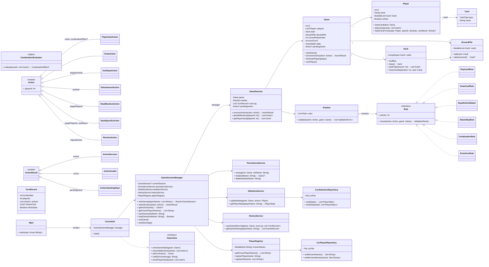

```mermaid
classDiagram
    direction LR

    %% Ядро игры
    class Game {
        - Int id
        - List~Player~ players
        - Deck deck
        - DiscardPile discardPile
        - Int currentPlayerIndex
        - Int extraTurns
        - GameState state
        - Action? pendingAction
        + startGame()
        + processAction(action: Action): ActionResult
        + eliminatePlayer(player)
        + nextPlayer()
    }

    class Player {
        - Int id
        - String name
        - MutableList~Card~ hand
        - Boolean isAlive
        + drawCard(deck: Deck)
        + playCards(cards: List~Card~)
        + stealCardFrom(target: Player, specific: Boolean, cardName: String?)
    }

    class Card {
        - CardType type
        - String name
    }

    class Deck {
        - ArrayDeque~Card~ cards
        + shuffle()
        + draw(): Card
        + peekTop(amount: Int): List~Card~
        + insertCardAt(position: Int, card: Card)
    }

    class DiscardPile {
        - MutableList~Card~ cards
        + add(card: Card)
        + takeAnyCard(): Card?
    }

    class CombinationEvaluator {
        <<object>>
        + evaluate(cards: List~Card~): CombinationEffect?
    }

    %% Правила валидации
    class Rule {
        <<interface>>
        + check(action: Action, game: Game): ValidationResult
        + priority: Int
    }

    class PlayCardRule
    class DrawCardRule
    class NopeRuleValidator
    class AttackSkipRule
    class CombinationRule
    class ExtraTurnRule

    Rule <|.. PlayCardRule
    Rule <|.. DrawCardRule
    Rule <|.. NopeRuleValidator
    Rule <|.. AttackSkipRule
    Rule <|.. CombinationRule
    Rule <|.. ExtraTurnRule

    class RuleSet {
        - List~Rule~ rules
        + validate(action: Action, game: Game): List~ValidationError~
    }

    %% Действия
    class Action {
        <<sealed>>
        + playerId: Int
    }
    Action <|-- PlayCardsAction : cards, combinationEffect?
    Action <|-- DrawAction
    Action <|-- UseNopeAction : targetActionId
    Action <|-- DefuseInsertAction : position
    Action <|-- StealRandomAction : targetPlayerId
    Action <|-- StealSpecificAction : targetPlayerId, cardName
    Action <|-- ResolveAction : originalAction

    %% Результаты действий
    class ActionResult {
        <<sealed>>
    }
    ActionResult <|-- ActionSuccess : events
    ActionResult <|-- ActionInvalid : errors
    ActionResult <|-- ActionAwaitingNope : pendingAction

    %% Сессия и менеджер
    class GameSession {
        - Game game
        - RuleSet ruleSet
        - List~TurnRecord~ turnLog
        - Action? pendingAction
        + processAction(action: Action): ActionResult
        + getValidActions(playerId: Int): List~Action~
        + getPlayerHand(playerId: Int): List~Card~
    }

    class GameSessionManager {
        - GameSession? currentSession
        - PersistenceService persistenceService
        - StatisticsService statisticsService
        - HistoryService historyService
        - PlayerRegistry playerRegistry
        + newGame(playerNames: List~String~): Result~GameSession~
        + submitAction(action: Action): ActionResult
        + getActiveGame(): Game?
        + getKnownPlayerNames(): List~String~
        + saveGame(slotName: String)
        + loadGame(slotName: String): Boolean
        + exitGame()
        + shutdownApp()
    }

    %% Сервисы
    class PersistenceService {
        + save(game: Game, slotName: String)
        + load(slotName: String): Game?
        + deleteSlot(slotName: String)
    }

    class StatisticsService {
        + updateStats(game: Game, winner: Player)
        + getPlayerStats(playerName: String): PlayerStats
    }

    class CsvStatisticsRepository {
        - File csvFile
        + readStats(): List~PlayerStats~
        + writeStats(stats: List~PlayerStats~)
    }

    class HistoryService {
        + saveGameRecord(game: Game, turnLog: List~TurnRecord~)
        + getGameHistory(playerName: String): List~GameRecord~
    }

    class TurnRecord {
        - Int turnNumber
        - Int playerId
        - List~Action~ actions
        - Card? drawnCard
        - Boolean eliminated
    }

    %% Реестр игроков
    class PlayerRegistry {
        - MutableSet~String~ knownNames
        + getKnownPlayerNames(): List~String~
        + registerPlayer(name: String)
        + registerAll(names: List~String~)
    }

    class CsvPlayerRepository {
        - File csvFile
        + readKnownNames(): Set~String~
        + writeKnownNames(names: Set~String~)
    }

    %% UI (абстракция)
    class GameView {
        <<interface>>
        + showGameState(game: Game)
        + showValidActions(actions: List~Action~)
        + askForAction(): Action
        + notifyError(message: String)
        + showPlayerHand(cards: List~Card~)
    }

    class ConsoleUI {
        - GameSessionManager manager
        + start()
    }

    %% Точка входа
    class Main {
        + main(args: Array~String~)
    }

    %% Связи
    Game "1" --> "*" Player
    Game "1" --> "1" Deck
    Game "1" --> "1" DiscardPile
    Player "1" --> "*" Card : hand
    Deck --> DiscardPile

    RuleSet o--> Rule : contains

    GameSession --> Game
    GameSession --> RuleSet
    GameSessionManager --> GameSession : manages
    GameSessionManager --> PersistenceService
    GameSessionManager --> StatisticsService
    GameSessionManager --> HistoryService
    GameSessionManager --> PlayerRegistry

    StatisticsService --> CsvStatisticsRepository
    PlayerRegistry --> CsvPlayerRepository

    Main --> ConsoleUI : creates
    ConsoleUI --> GameSessionManager
    ConsoleUI ..|> GameView
```